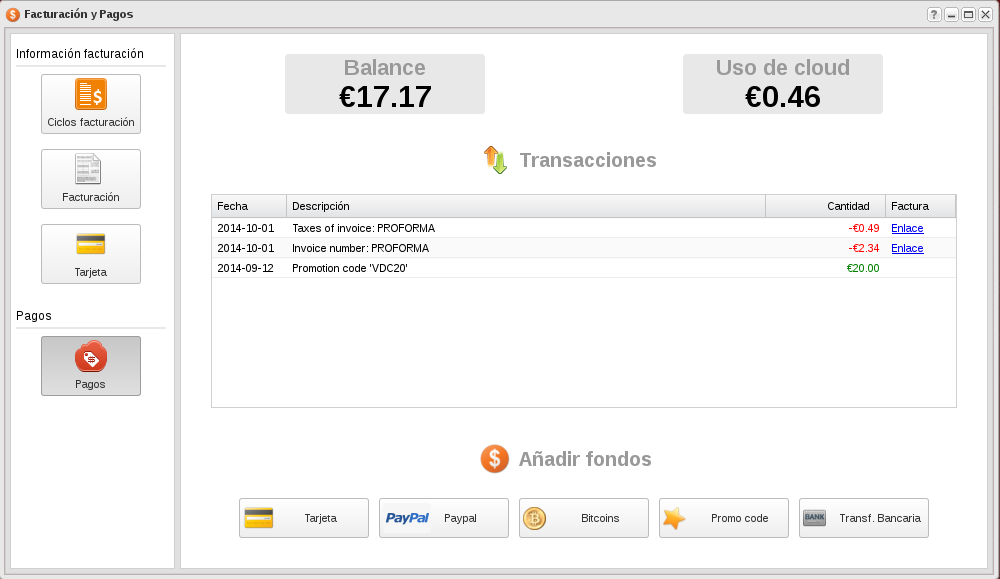
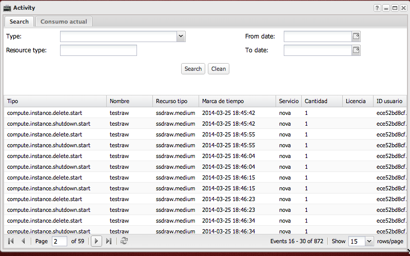
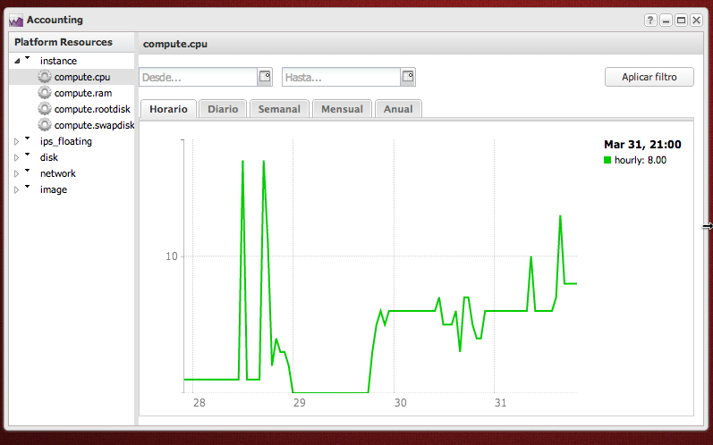

### Facturación y Pagos

Cada usuario puede ver de manera instantánea cuanto lleva consumido en el ciclo actual de facturación. Cada ciclo de facturación abarca desde el primer día del mes hasta último. Si se trata del ciclo del mes corriente, se denomina Ciclo actual.

El Ciclo actual es actualizado cada 60 minutos con el nuevo consumo que haya realizado el usuario. En el ciclo actual se sumariza el consumo de todos los recursos agrupados por Productos y Recursos. Al final del ciclo actual al usuario se le emite una factura por todos los recursos usados.

Para más información: [Pay as you go - Pago por uso](https://docs.stackops.net/payasyougo-es.html)

### Actividad del sistema

La tabla principal muestra los eventos que se han producido en el proyecto, y muestra información como el tipo de evento, nombre del recurso que ha generado el evento, fecha, ...

En al pestaña **Consumo actual** podemos ver qué recursos están siendo contabilizados por la plataforma. La información mostrada es la información que se utiliza para computar el gasto en la hora en curso. Por eso, lo que el usuario ve no es lo que está creando de manera instantánea, sino qué fue creado antes de la hora de tiempo actual y sigue en marcha.

### Contabilidad y uso del sistema

Lo que se muestra en la zona gráfica es una agregación de los recursos consumidos en función de la rodaja de tiempo elegida. Es decir:

* Si elige el rango horario, la gráfica mostrará los recursos por hora consumidos por la plataforma. Esta es la información se usa para calcular el coste del uso de la plataforma, por lo que probablemente sea la gráfica principal elegida.
* Si elige el rango Diario, la gráfica mostrará los recursos por día consumidos por la plataforma. Lo mismo ocurrirá para el resto de los rangos Semanales, mensuales y anuales.

Recuerde que para poder visualizar la información, debe haber transcurrido al menos el rango elegido. Es decir, si quiere visualizar los recursos consumidos en una semana, deberá haber pasado al menos una semana de uso.

