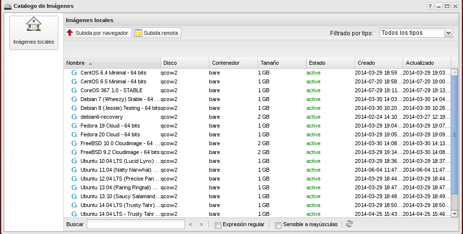

Una imagen de máquina virtual, o de forma abreviada una imagen, es un fichero
que contiene un disco virtual con un sistema operativo con la configuración
mínima para poder operar adecuadamente dentro de una nube de
infraestructura. Existen muchos tipos de formatos de imagen, siendo los más
conocidos los relacionados con los hipervisores más conocidos: VMDK para VMware,
qcow2 para QEMU/KVM, etc. o el formato (ami-ari-aki propio de
Xen y muy habitual en IaaS por ser el que utiliza Amazon EC2).

Teniendo en cuenta el enfoque de recursos compartidos que se utiliza en IaaS, es
muy frecuente que se compartan entre todos los usuarios un conjunto de imágenes
genéricas con los sistemas operativos más habituales, es lo que se conoce como
imágenes públicas. También es posible que el usuario suba o gestione sus propias
imágenes, con el grado de configuración que desee.

Las imágenes se utilizan para instanciar las máquinas virtuales que realmente
utiliza el usuario.

## Catálogo de imágenes

Para ver las imágenes que inicialmente podemos utilizar abrimos el **Catálogo de
Imágenes**:

### Subir una imagen

Podemos subir nuestras propias imágenes a través de las opciones  **Subida por
navegador** (en el que podemos subir imágenes que tengamos almacenadas en
nuestro ordenador) o **Subida remota** (subimos imágenes indicando la url donde
se encuentra la imagen). Podríamos utilizar cualquier método, pero en este
ejemplo vamos a usar la **Subida por navegador**, donde vamos a indicar los
siguientes datos:
	
  * Nombre : Nombre que asignaremos a la nueva imagen.
  * Fichero de Imagen : Indicamos la ruta completa al fichero donde está la imagen.
  * Formato de disco : Seleccionamos el formato de la imagen. Los formatos
  soportados son : 
    * qcow2 : Soportado por el emulador QEMU que puede expandirse de forma
    dinámica.
    * raw : Un formato de imagen de disco desestructurado, si se tiene un
    fichero sin extensión entonces probablemente se trate de un formato raw. 
    * iso : Un formato de ficheros para datos contenidos en un disco óptico,
    como por ejemplo un CD-ROM.
    * vmdk : Formato de disco común, soportado por muchos hipervisores, en
  * particular VMware.  
    * aki : Una imagen kernel de Amazon EC2.
    * ari: Una imagen de disco en RAM de Amazon EC2.
    * ami : Una imagen de máquina Amazon, que precisa de una imagen aki y
    habitualmente de otra ari para poder arrancar.
  * Imagen pública : Con este parámetro indicamos si queremos que la imagen
  sea pública para todos los usuarios.

En este caso vamos a subir una pequeña imagen de una distribución de GNU/Linux
conocida como CirrOS que se utiliza para pruebas en entornos de IaaS.

  * Abrimos en el navegador la URL
  [http://download.cirros-cloud.net/0.3.3/](http://download.cirros-cloud.net/0.3.3/)
  * Descargamos en nuestro equipo la imagen
  [cirros-0.3.3-x86_64-disk.img](http://download.cirros-cloud.net/0.3.3/cirros-0.3.3-x86_64-disk.img)
  * Instalamos el paquete qemu-utils
  * Obtenemos la información de la imagen de CirrOS descargada:

<pre>
:~/Descargas$ qemu-img info cirros-0.3.3-x86_64-disk.img
image: cirros-0.3.3-x86_64-disk.img
file format: qcow2
virtual size: 39M (41126400 bytes)
disk size: 16M
cluster_size: 65536
Format specific information:
compat: 0.10
</pre>

En el que podemos ver que se trata de una imagen en formato qcow2 con un disco
virtual de tan solo 39 MB.

  * Subimos la imagen a Cirrusflex
  
También es posible crear una imagen de cualquier sistema operativo creando una
máquina virtual con una serie de requisitos, pero es un tema que va más allá de
los objetivos de este curso de introducción al uso de IaaS, pero que un lector
interesado puede realizar siguiendo los pasos que encontrará en la documentación
que se enlaza en la siguiente sección.

### Enlaces interesantes

  * [OpenStack Virtual Machine Image Guide](http://docs.openstack.org/image-guide/content/)

