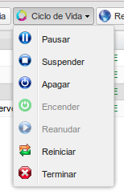
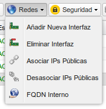
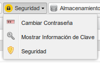
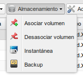
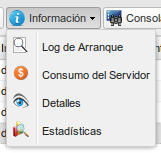

### Acciones del ciclo de vida de las instancias

Una de las cosas que llama la atención cuando se empieza a utilizar IaaS es que
se hable del ciclo de vida de un servidor, ya que en infraestructura clásica
(tanto de máquinas físicas como virtuales) no existe este concepto, ya que en
infraestructura clásica se espera que un servidor se encienda, se configure y no
se apague salvo en casos excepcionales. La diferencia fundamental con la
infraestructura en nube es que en este caso, se pude tener infraestructura
dinámica compuesta por un número variables de servidores con características
adecuadas para la demanda que haya en cada momento, por eso es importante
controlar de que forma se puede parar, reiniciar o incluso destruir una
instancia.

Las diferentes acciones que se pueden realizar sobre una instancia una vez
creada son las siguientes:

* **Pausar una instancia**: Paramos la ejecución de una instancia, guardando su
  estado en memoria RAM.
* **Suspender una instancia**: Paramos la ejecución de una instancia, guardando
  su estado en disco.
* **Apagar una instancia**: Apagamos la máquina virtual, pero sigue definida,
  por lo que puede volver a arrancarse con las mismas características cuando sea
  necesario.
* **Encender la instancia**: Si tenemos una instancia apagada, nos permite
  encenderla.
* **Reanudar la instancia**: Si tenemos una instancia suspendida o pausada, nos
  permite indicar que la máquina siga funcionando. 
* **Reiniciar la instancia**: Ejecuta un comando *reboot* en la instancia.
* **Terminar la instancia**: Destruye la instancia, liberando los recursos que
  tenía ocupados.

### Acciones de la configuración de red de la instancia

Este apartado lo veremos más detenidamente cuando estudiemos la gestión de las
redes en OpenStack, pero como podemos observar podemos añadir o eliminar nuevas
interfaces de red a nuestra instancia, y cómo hemos visto anteriormente podemos
gestionar la asociación o desasociación de las IPs flotantes.

### Acciones sobre la configuración de la seguridad de la instancia

* En algunos casos es posible **cambiar la contraseña para el acceso a la
  instancia.**, aunque de forma general el acceso se hace utilizando pares de
  claves pública/privada como hemos explicado con anterioridad.
* Podemos acceder a **la información de la clave pública que se ha usado al
  crear la instancia.**
* Podemos **administrar los Grupos de Seguridad de nuestra instancia**, añadir o
  quitar grupos de seguridad aplicados a la instancia.

### Acciones de la configuración del almacenamiento de la instancia

Como estudiaremos en la unidad de
[Volúmenes](http://iesgn.github.io/cloud2/curso/u3/), podemos **asociar o
desasociar un volumen a una instancia**. Además como veremos en la segunda
sesión de la unidad de *Instancias* podemos realizar una **instantánea o una
copia de seguridad** de nuestra instancia. 

### Acciones de gestión de las instancias

En la próxima sesión de esta unidad también estudiaremos la **redimensión y el
rescate de las instancias**. 

### Acceso a la información de las instancias

* Podemos acceder al **log de arranque de la instancia**. 
* También podemos acceder a las **tarifas de consumo de nuestra máquina**.
* La opción **Detalles** nos muestra información detallada de nuestra
  instancia.
* Por último, podemos acceder a una **consola VNC** para manejar nuestra
  instancia como si se tratase de una máquina virtual, aunque deberá estar
  definida previamente la contraseña del usuario.
