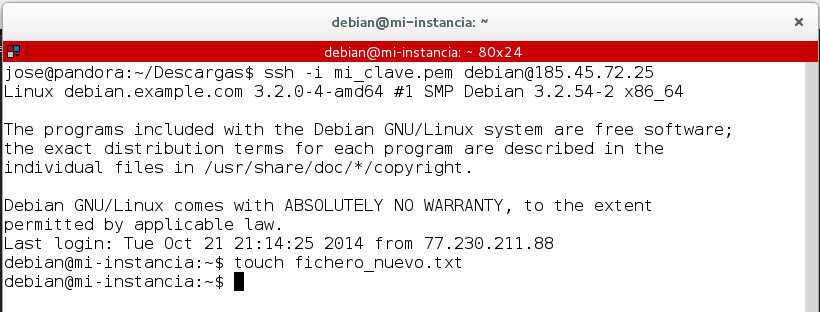
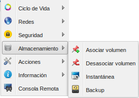
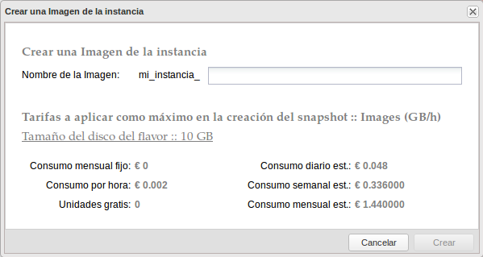
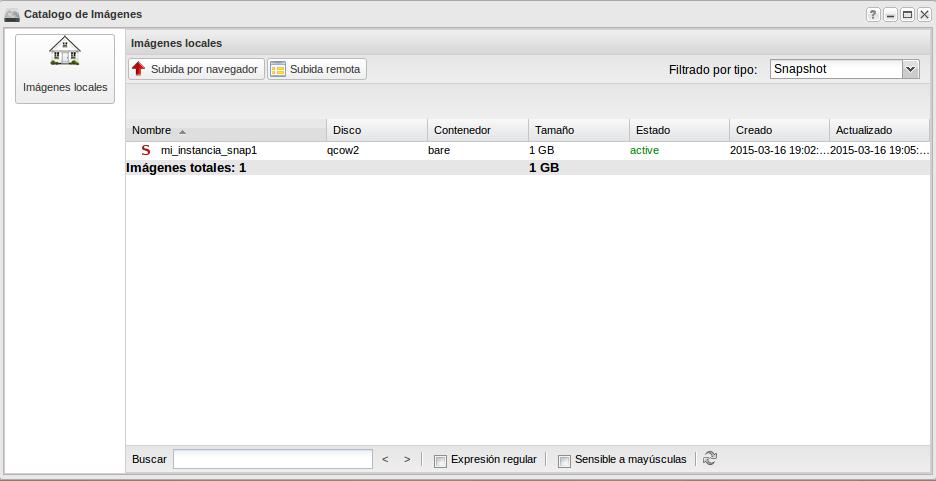
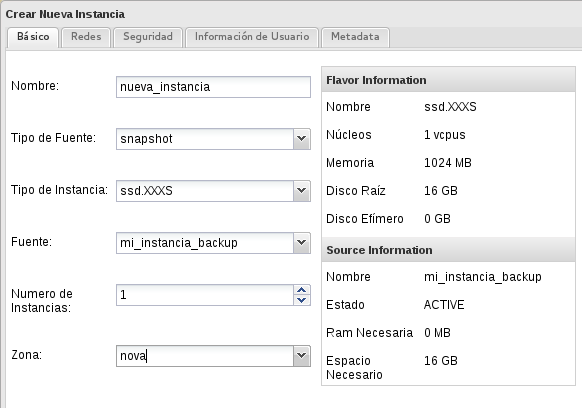
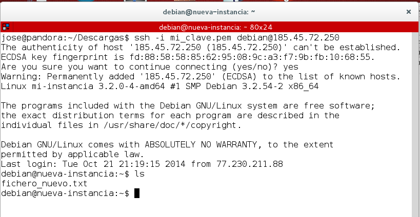
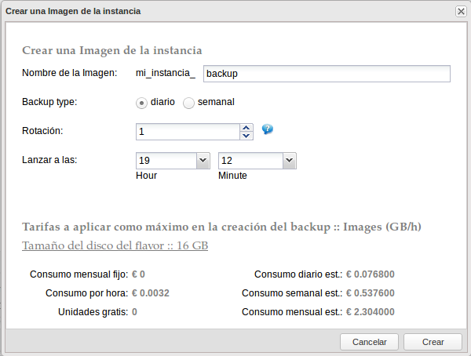

## Instantáneas (*snapshots*)

En cualquier momento se puede crear una instantánea de una instancia,
con lo que se creará una nueva imagen con el estado actual de la
instancia. Es una funcionalidad muy interesante, ya que al almacenarse
como una nueva imagen, es posible realizar posteriormente el número de
nuevas instancias que se deseen, este proceso es diferente cuando se
utilizan volúmenes para almacenar el sistema raíz de una instancia,
como se verá en el siguiente tema.

Veamos cómo se hace partiendo de una instancia Debian que se está
ejecutando.

1. Vamos a acceder a la instancia y vamos a realizar un cambio sobre
ella, lo mas sencillo es crear un fichero de texto.

2. A continuación vamos a realizar una instantánea de la instancia,
con lo que se nos creará una nueva imagen desde la que podremos crear
nuevas instancias.

  * Creamos la instantánea escogiendo la opción de **Instantánea**:

  * Y podemos observar que en **Catálogo de imágenes** encontramos una nueva
  imagen de tipo *snapshot*:

  

  * A continuación podemos crear una nueva instancia a a partir de esta
  instantánea: 

* Y por último podemos acceder a la nueva instancia (a la que le
hemos asignado una nueva IP pública y a la que hemos asociado la
clave SSH mi_clave.pem), y comprobar que tiene el fichero que
creamos en la instancia anterior: 

## Copias de seguridad (*Backups*)

OpenStack también ofrece la posibilidad de programar la creación de
instantáneas, puesto que esto puede ser una opción muy interesante
para una gestión rudimentaria de copias de seguridad (ya que sólo se
trataría de copias completas), se le asigna el nombre de copias de
seguridad o *backup*.

El campo **Rotación** es el número máximo de instantáneas que se van a
almacenar, superado ese número se eliminará la instantánea más antigua.
