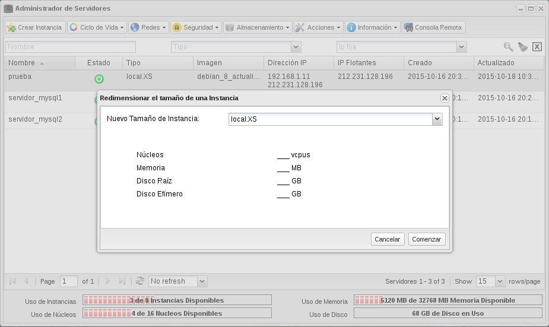
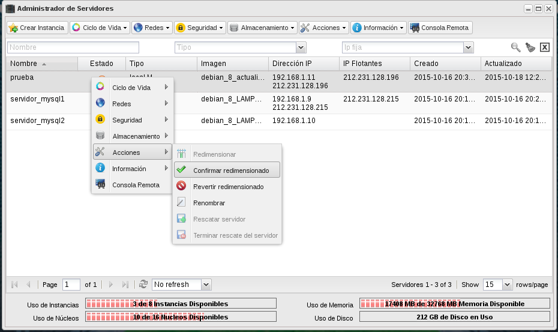

Esta acción sirve para cambiar las características hardware del
servidor, modificando el tipo de instancia (sabor) asociado
al mismo. Este proceso también se conoce como escalado vertical o
*scale up*.

Para Realizar estas operaciones el usuario deberá seleccionar el
servidor y elegir la opción de **Redimensionar**.

Este proceso se realiza en dos pasos, ya que en un primer paso se
verifica que es posible realizarlo y si se concluye satisfactoriamente
el servidor pasa al estado VERIFY_RESIZE tras el que se le ofrecen al
usuario dos opciones: **Confirmar la redimensión** o **Revertir la
redimensión**.

* Hemos creado una instancia con un flavor ssd.XXXS, y la vamos a
  redimensionar:

* Elegimos otro tipo de instancia (sabor):
* Terminamos confirmando o revirtiendo la redimensión:

Para más información puedes ver este
[vídeo](https://www.youtube.com/watch?v=p-kNbawLd2U).

