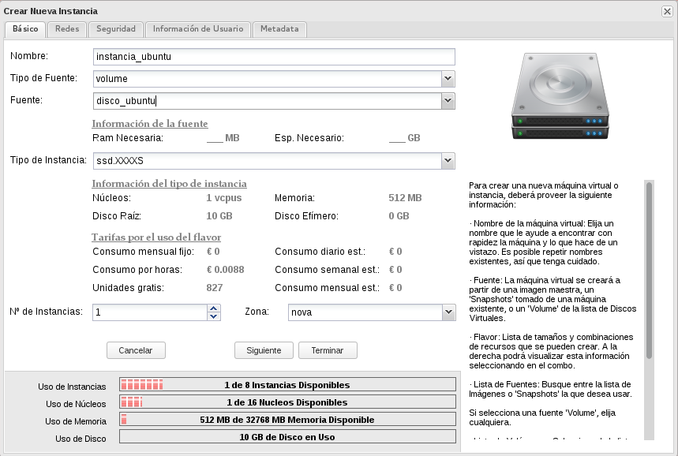
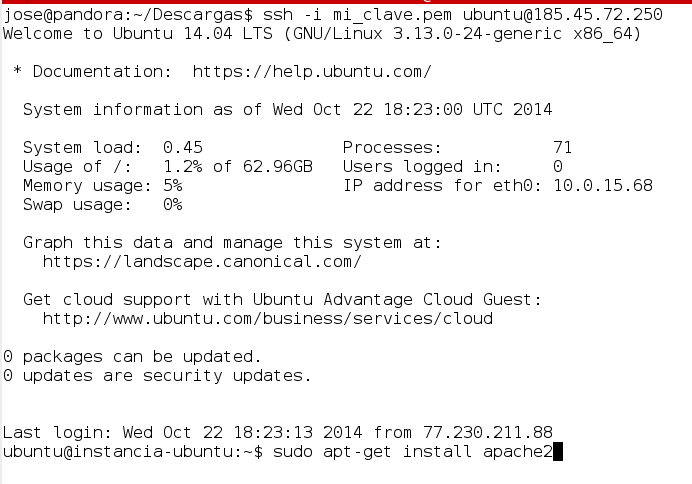
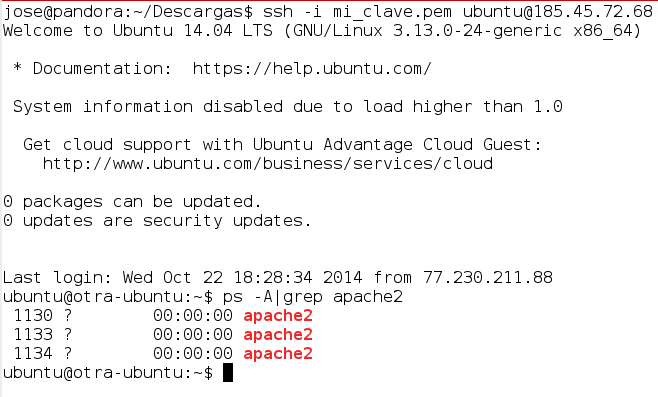

Las instancias que hemos cread hasta ahora poseen un disco (*/dev/vda*) efímeros, es decir, su ciclo de vida es exactamente igual al de la instancia, por tanto cunado terminamos la instancias, el disco se destruye.

Tenemos la posibilidad de crear discos a partir de imágenes de sistemas operativos, además estos discos serán arrancables, por lo que las instancias creadas sobre estos discos tendrán una almacenamiento permanente, es decir, aunque terminemos la instancia la información del disco no se perderá, con lo que se podrá crear una nueva instancia usando el disco y mantendrá toda la información y configuración que la instancia anterior.

Veamos los pasos que tenemos que realizar:

1. Creamos un nuevo disco a partir de una imagen de un sistema operativo Ubuntu 14.04 Server.

	

2. Ahora creamos una nueva instancia cuyo origen será el disco que hemos creado.

	

3. Vamos a acceder a la instancia y vamos a realizar un cambio por ejemplo vamos a instalar un servidor web.

	

4. Terminamos esta instancia (el volumen no se va a destruir) y creamos una nueva instancia a partir del mismo volumen (le vamos a asignar otra IP pública para que apreciemos que estamos accediendo a otra instancia). Vamos a comprobar que el servidor apache2 ya está instalado.

	

