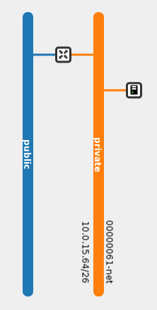
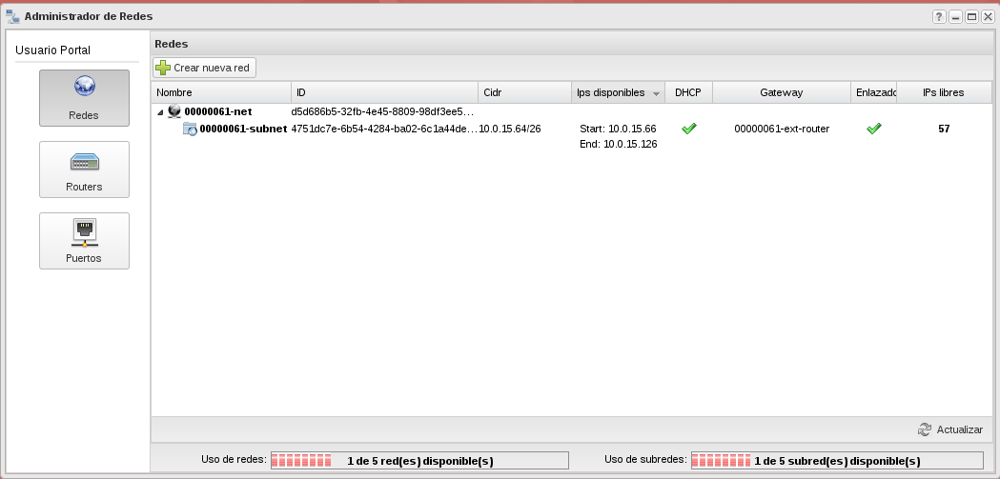
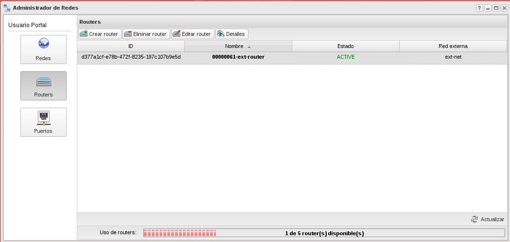
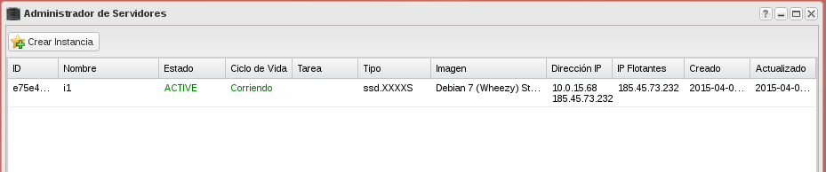

## Conceptos previos

### Red

Red Dominio aislado de capa 2. Sería el equivalente a una VLAN. Las redes externas solo pueden ser definidas por el administrador.

### Subred

Bloque de direcciones IPv4 o IPv6 que se asignan a las máquinas virtuales que se conectan a ella.

### Router

Dispositivo de capa 3 para conectar redes.

### Puerto

Puerto virtual de un switch o router. 

### IP Fija

Dirección IP con la que se crean una instancia en una red y que se utiliza para comunicación interna. La dirección IP fija no cambia durante la vida de la instancia.

### IP Flotante

Dirección IP asociada a una instancia en un momento dado para poder acceder a ella desde fuera. Una IP flotante puede asignarse a otra instancia diferente cuando se estime oportuno.

## Esquema de red por defecto

El esquema de red por defecto que nos encontramos en nuestro proyecto esta definido por un router conectado a la red externa, y una red interna donde se conectan las instancias. Podríamos resumirlo en el siguiente esquema:

Si accedemos a la opción **Administrador de redes**, en el apartados **Redes** vemos lo siguiente:

Podemos observar que en nuestro proyecto tenemos definida una red, que tiene asociada una subred con el direccionamiento 10.0.15.64/26, del conjunto de direcciones podemos asignar a nuestra instancias desde la 10.0.15.66 hasta la 10.0.15.126. También observamos que nuestra red está conectada al router de nuestro proyecto en mi caso se llama *00000061-ext-router*.

Ahora podemos ver los routers definidos en mi proyecto:

Podemos comprobar que el router está conectado a la red externa.

Por último podemos ver los puertos relacionados a nuestra red:

En nuestro escenario tenemos los siguientes dispositivos conectados a nuestra red:

* Nuestro router está conectado a nuestra red con la dirección IP 10.0.15.65, por lo tanto la puerta de enlace de las instancias será está ip.
* Las IP fijas de nuestra instancias se asignan por un servidor dhcp, en nuestra red por defecto tenemos dos dispositivos servidores dhcp (en mi caso el 10.0.15.66 y el 10.0.15.67). Es una medida que adopta cirrusflex es para asegurar que la asignación va a tener éxito (alta disponibilidad) aunque realmente no es necesario tener dos servicios dhcp.
* Por último observamos que tenemos una instancia conectadas a una red que ha tomado la ip fija 10.0.15.68.

Por lo tanto cómo veíamos en la primera pantalla tenemos 57 direcciones ip libres.

Efectivamente en la siguiente imagen podemos ver la instancia que tenemos conectada a la red:

A dicha instancia le hemos asignado una ip flotante (185.45.73.232). Esa operación está creando las reglas de cortafuegos tipo NAT necesarias para que la instancia salga al exterior con la IP flotante asociada (SNAT) y para que podamos acceder a la instancia a través de los puertos abiertos en nuestro **grupo de seguridad** (DNAT).

