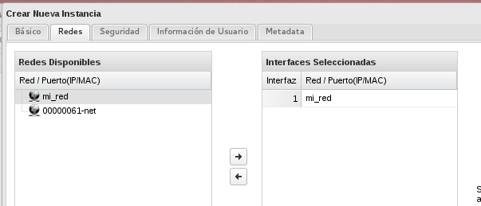

Una vez creado nuestra nueva red, conectada a un nuevo router vamos a crear una instancia en la nueva red y vamos a comprobar que se le puede asociar una ip flotante, además vamos a comprobar que podemos hacer ping a otra instancia que está conectada a la otra red.

1. A la hora de crear la nueva instancia tenemos que asegurarnos que conectamos a la nueva red.

	

2. Podemos comprobar en la siguiente imagen que la nueva instancia tiene una IP fija en el rango de la nueva red (192.168.0.2) y que tiene asociada una ip pública.

	

3. Por último podemos comprobar que la instancias no tienen conectividad. Si accedemos a una de ella, y hacemos ping a la ip fija de la otra, evidentemente, no tendremos conectividad.