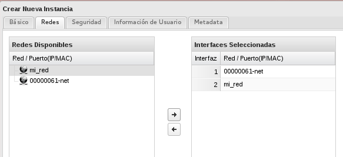
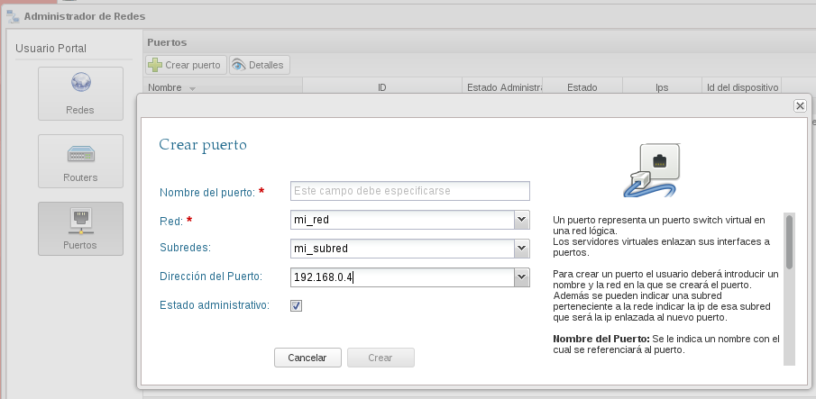
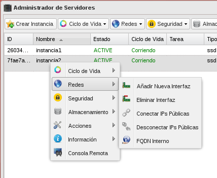

Una vez que hemos estudiado como crear nuevas redes y routers, nos falta una características que puede ser muy interesante para distintas infraestructuras: **la posibilidad de que nuestra instancias tengan varias interfaces de red conectada a una o a diferentes redes**.

### Añadir una interfaz de red a nuestra instancía

Tenemos dos formas de realizar esta operación:

1. Durante la creación de la instancia indicamos las redes a la que va a estar conectada la instancia, el orden de elección es importante, ya que la primera interfaz (en caso de linux eth0) estará conectada a la primera red que hayamos escogido, y así consecutivamente.

	

2. Si tenemos una instancia ejecutándose podemos añadir una interfaz en cualquier momento, para ello debemos crear un puerto en la red correspondiente:

	

	y a continuación escoger la opción de **Añadir Nueva Interfaz** y luego seleccionamos el puerto creado anteriormente.

	

### Posibles utilidades

1. Crear una instancia que este conectada a dos redes internas. Esta instancia estará conectada a las instancias de una y otra red, y en ella se podrán configurar, por ejemplo, servicios de enrutamiento y cortafuegos.
2. Crear una instancia que tenga dos interfaces conectas a una misma red, por lo tanto tendremos una instancia con varias ip flotantes asignadas, y de este modo, por ejemplo configurar un servidor web, que sirva varios hosting virtuales en cada una de las ip públicas.

