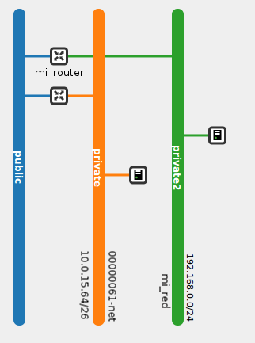
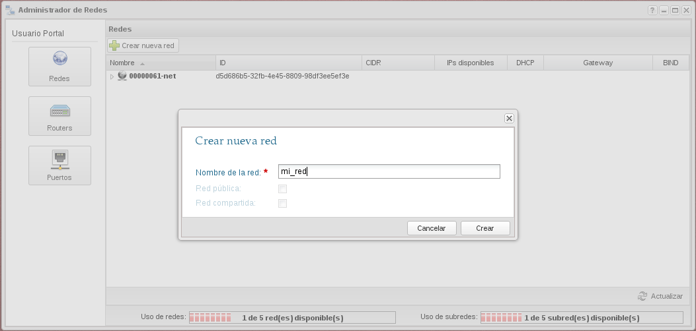
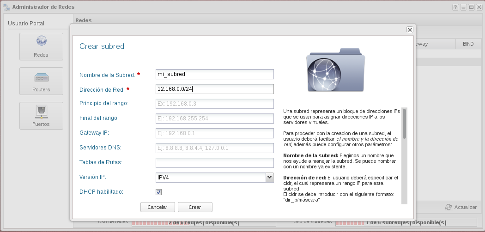

En esta demostración vamos a crear una nueva red, una nueva subred y un nuevo router. El router estará conectado a la red externa y a la nueva red creada. El esquema de red sería el siguiente:

1. En el apartado **Administrador de redes** vamos a crear una nueva red.

	

2. A continuación seleccionamos la red creada y creamos una subred. Los datos que podemos introducir en esta pantalla son los siguientes:

* Nombre de la Subred: El usuario deberá indicar un nombre a proporcionarle a la subred.
* Dirección de red: Se debe introducir un CIDR válido, el cual indicará un bloque de direcciones IPs.
* Principio de rango: Indica el principio de las direcciones IPs que se utilizarán para asignar IPs a los servidores virtuales. Esta dirección debe pertenecer a las direcciones del CIDR. Debe ser menor que la IP especificada en Final de Rango.
* Final de rango: Indica el final de las direcciones IPs que se utilizarán para asignar IPs a los servidores virtuales. Esta dirección debe pertenecer a las direcciones del CIDR. Debe ser mayor que la IP especificada en Principio de Rango.
* Gateway IP: Dirección IP que especificamos para la puerta de enlace. Debe pertenecer a las direcciones del CIDR. Si se especifica este valor tenemos que comprobar que esta dirección no se superpone a alguna dirección del pool de direcciones.
* Servidores DNS : El usuario puede especificar una lista de dns. Este campo se introduce separado por comas.
* Versión IP: Se especifica la versión de las direcciones IPs.
* DHCP habilitado: Especificamos si queremos que el DHCP este activo.

