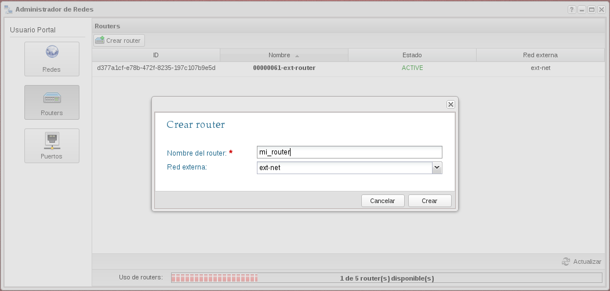
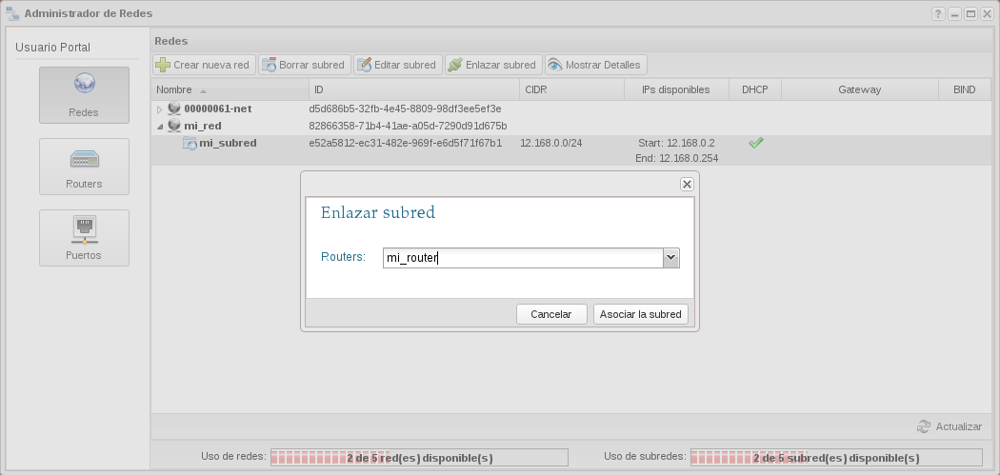
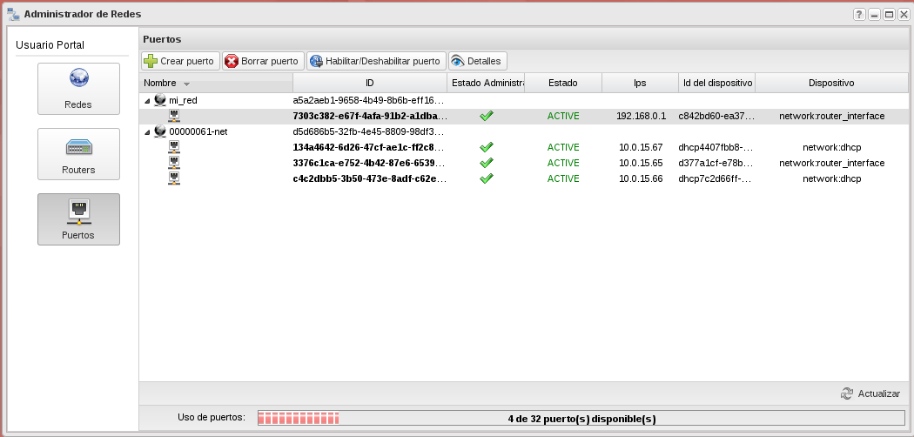

Una vez que hemos creado una nueva red interna, necesitamos crear un router que nos permita conectar esta red con la red externa. Para ello:

1. A continuación vamos a crear un router, podemos también indicar si va a estar conectado a la red externa.

	

2. A continuación vamos a conectar la nueva red al router que hemos creado, para ello seleccionamos la subred y escogemos la opción **Enlazar subred**.

	

3. Podemos comprobar en la lista de puertos que nuestro router esta conectado a nuestra nueva red.

	
