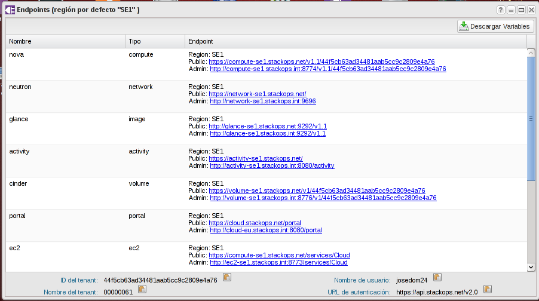

Hasta ahora hemos utilizado un entorno web para gestionar nuestra
infraestructura ya que es más cómodo al principio para comprender
conceptos y es más adecuado en un curso de iniciación a la nube de
infraestructura, pero en situaciones más reales es muy habitual
utilizar la línea de comandos o incluso programar con un lenguaje de
alto nivel la gestión de la infraestructura, principalmente cuando
tenemos que realizar tareas repetitivas o automáticas.
Una visión amplia de la administración de la infraestructura desde la
línea de comandos o la gestión de la infraestructura como código está
fuera de los objetivos de este curso, pero sí consideramos adecuado
una breve introducción a estos conceptos.

## API REST
Las API REST son un tipo de arquitecturas de desarrollo que utilizan
el protocolo HTTP y son ampliamente utilizadas hoy en día en Internet
para la extracción y modificación de datos automáticamente por
aplicaciones web y móviles. Las APIs REST no quedan ahí, sino que 
también se están convirtiendo en elementos cada vez más comunes en las
arquitecturas de sistemas ya que facilitan la programación de tareas y
la conexión sencilla entre diferentes aplicaciones.
Las principales características de REST son:

* Se define una o varias URIs para la comunicación entre el cliente y
el servidor, que proporciona una sintaxis universal para identificar
los recursos
* Se definen una serie de operaciones utilizando métodos HTTP GET,
POST, PUT y DELETE
* Se utiliza habitualmente un lenguaje de marcas para las peticiones y
las respuestas. Inicialmente el lenguaje más utilizado era XML, pero
cada vez se utiliza más JSON.

### Ejemplo de API REST
<a href="http://openweathermap.org/">OpenWeatherMap</a> es un sitio
web que ofrece una API REST pública sobre información meteorológica
muy sencilla de utilizar. Por ejemplo, para obtener la información
meteorológica actual de la ciudad de Málaga basta hacer:

    wget -qO- "api.openweathermap.org/data/2.5/weather?q=Malaga,spain&units=metric"
    
En la petición incluimos la URL de la API y utilizamos un método GET
pasando como parámetros la ciudad y el formato de las unidades. Como
respuesta obtenemos un fichero en formato JSON que contiene la
información solicitada (se ha formateado la salida para que sea más
fácil ver la información):

    {"coord":{"lon":-4.42,
              "lat":36.72},
     "sys":{"message":0.4024,
	    "country":"ES",
	    "sunrise":1429594523,
	    "sunset":1429642638},
     "weather":[{"id":800,
                 "main":"Clear",
		 "description":"sky is clear",
		 "icon":"02d"}],
     "base":"stations",
     "main":{"temp":16.452,
             "temp_min":12.712,
	     "temp_max":18.321,
	     "pressure":1014.73,
	     "sea_level":1031.78,
	     "grnd_level":1014.73,
	     "humidity":94},
     "wind":{"speed":0.85,
             "deg":155.506},
     "clouds":{"all":8},
     "dt":1429602273,
     "id":2514256,
     "name":"Malaga",
     "cod":200}

Peticiones y respuestas similares son las que utilizan los componentes
de OpenStack para comunicarse entre sí y principalmente para hacerlo
con usuarios o aplicaciones externas. Esto también permite que sea muy
fácil desarrollar aplicaciones a medida que utilicen OpenStack, como
por ejemplo el entorno web que utiliza StackOps para Cirrusflex.

## Componentes de OpenStack
OpenStack es un proyecto modular formado por diferentes componentes
independientes que ofrecen a los usuarios y al resto de componentes de
OpenStack una API REST con la cual interactuar. Actualmente la versión
oficial de OpenStack incluye unos 15 componentes diferentes, aunque en
este curso hemos utilizados sólo los componentes principales que son:

|Nombre|Componente|Función|
|------|----------|-------|
|Nova|OpenStack Compute|Gestión de las instancias|
|Glance|OpenStack Image|Gestión de las imágenes|
|Keystone|OpenStack Identity|Gestión de usuarios, permisos y proyectos|
|Cinder|OpenStack Block Storage|Gestión de volúmenes|
|Neutron|OpenStack Networking|Gestión de las redes|

## Instalación de los clientes

Cada componente de OpenStack tiene su propio cliente de línea de
comandos con toda las funcionalidades, por lo que en principio
tendríamos que instalar los correspondientes a los cinco componentes
anteriores. Esto no va a ser necesario porque para el tipo de ejercicios que
vamos a realizar sólo vamos a utilizar los clientes de nova y neutron.

Los clientes de OpenStack son aplicaciones escritas en Python por lo
que recomendamos instalarlas en un equipo con alguna distribución de
GNU/Linux, si algún participante del curso prefiere hacerlo en Windows
o OS X tendrá que seguir los pasos de la <a
href="http://docs.openstack.org/user-guide/content/install_clients.html">documentación
oficial</a>.

### Instalación fácil
Si estás utilizando una distribución de GNU/Linux suficientemente
moderna podrás utilizar las versiones empaquetadas de los clientes de
OpenStack, en el caso de Ubuntu >= 14.04 o Debian >= 8, basta con
hacer:

    # apt-get install python-novaclient python-neutronclient

En caso de utilizar Red Hat o derivadas, habrá que añadir o verificar
los <a href="https://www.rdoproject.org/Repositories">repositorios de
RDO</a> e instalar posteriormente los paquetes con yum.

Una vez instalados los dos paquetes, deberíamos verificar que las
versiones son las correctas para utilizar Cirrusflex. Las versiones
mínimas necesarias son:

|Aplicación|Versión mínima Icehouse|Versión mínima Juno|
|----------|-----------------------|-------------------|
|nova|2.18.1|2.20|
|neutron|2.3.6|2.3.6|
|cinder|1.0.8|1.0.9|
|glance|0.12.0|0.13.1|
|swift|2.3.1|2.3.1|

Que podemos verificar una vez instalados los paquetes pasándole al
programa el modificador "--version":

    $ nova --version
    2.18.1
    $ neutron --version
    2.3.6

### Instalación "menos fácil"
Si la distribución de GNU/Linux que estamos utilizando es más antigua
y no incluye los paquetes de los clientes de OpenStack o incluye
versiones más antiguas, la mejor opción es utilizar los paquetes de
OpenStack directamente desde <a
href="https://pypi.python.org/pypi">pypi</a>.

#### Instalación de un entorno virtual de python
Hay que tener en cuenta que python es ampliamente utilizado por muchas
aplicaciones GNU/Linux por lo que cuando se instalan paquetes de
python más modernos o más antiguos de los que corresponden con la
distribución GNU/Linux que se está utilizando, es muy recomendable
hacerlo dentro de un entorno aislado que no afecte a la larga a las
versiones correspondientes de los paquetes del sistema. Hay varias
formas de hacer esto, en adelante vamos a explicar la forma de hacerlo
con <a
href="http://docs.python-guide.org/en/latest/dev/virtualenvs/">Python
Virtual Environments</a>:

Instalamos los paquetes python-virtualenv y python-dev con un usuario
privilegiado del sistema:

    sudo apt-get install python-dev python-virtualenv

Creamos un entorno virtual para instalar los clientes de
OpenStack con un usuario con privilegios normales:

    mkdir ~/Python
    virtualenv Python/Cirrusflex
    Running virtualenv with interpreter /usr/bin/python2
    New python executable in Python/Cirrusflex/bin/python2
    Also creating executable in Python/Cirrusflex/bin/python
    Installing setuptools, pip...done.

Lo que hemos hecho ha sido crear un entorno virtual de python en el
directorio $HOME/Python/Cirrusflex en el que se han instalado todos
los paquetes de python necesarios para poder utilizar Python pip
dentro de ese entorno y que los paquetes de python se instalen en
dicho directorio por un usuario normal sin afectar a los paquetes de
python del sistema.

#### Utilización de un entorno virtual de python
Cada vez que vayamos a utilizar los paquetes de python de este entorno
virtual o queramos instalar algún paquete nuevo, debemos activarlo
mediante la instrucción:

    usuario@oslo:~$ source ~/Python/Cirrusflex/bin/activate
    (Cirrusflex)usuario@oslo:~$

Como vemos se indica en el prompt con el prefijo *(Cirrusflex)* que
estamos dentro del entorno virtual.

Cuando estemos dentro del entorno virtual de python y queramos salir
basta con hacer:

    (Cirrusflex)usuario@oslo:~$ deactivate
    usuario@oslo:~$

#### Instalación de los clientes de OpenStack
Los pasos anteriores son necesarios para instalar los paquetes de los
clientes de OpenStack sin afectar a los paquetes de python del
sistema, pasamos ahora a explicar los pasos necesarios para instalar
los clientes de OpenStack.

En primer lugar entramos en el entorno virtual de python:

    usuario@oslo:~$ source ~/Python/Cirrusflex/bin/activate
    (Cirrusflex)usuario@oslo:~$

Una vez dentro del entorno virtual utilizamos la instrucción pip para
instalar los paquetes python necesarios directamente desde pypi:

    (Cirrusflex)usuario@oslo:~$ pip install requests python-novaclient==2.18.1 python-neutronclient==2.3.6

## OpenStack Endpoints
OpenStack denomina *endpoint* a las URLs de las APIs de sus diferentes
componentes y en el caso de Cirrusflex podemos verlas picando en el
icono *Endpoints Portal Plugin*:

Realmente esa información no nos va a hacer falta directamente, sino
que va a ser mucho más sencillo utilizar esas APIs porque basta que
pulsemos el botón *Descargar variables* y nos podremos descargar a
nuestro equipo el fichero **values.sh**. Para utilizar los clientes de
OpenStack desde la línea de comandos tenemos que ejecutar la siguiente
instrucción:

    source values.sh

Se nos preguntará por la contraseña de nuestro usuario de Cirrusflex y
nos quedará el entorno configurado para poder utilizarlo.