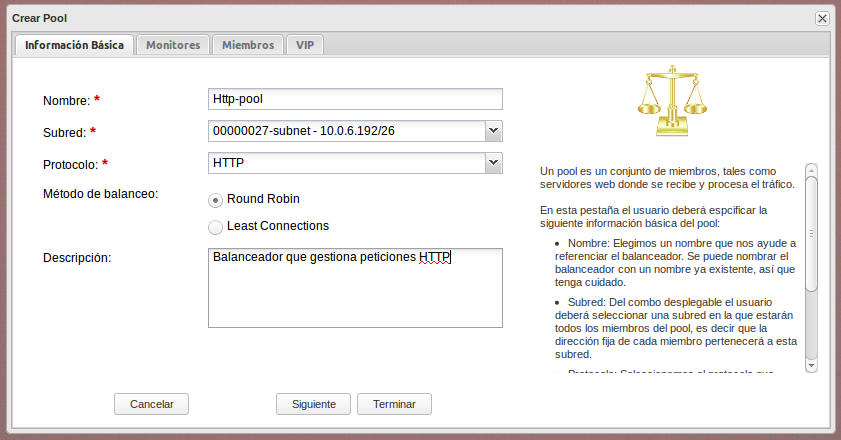
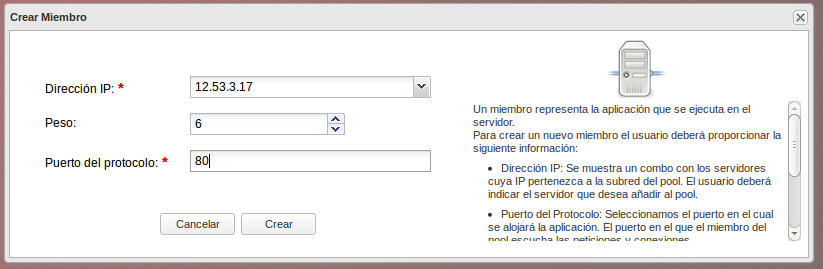
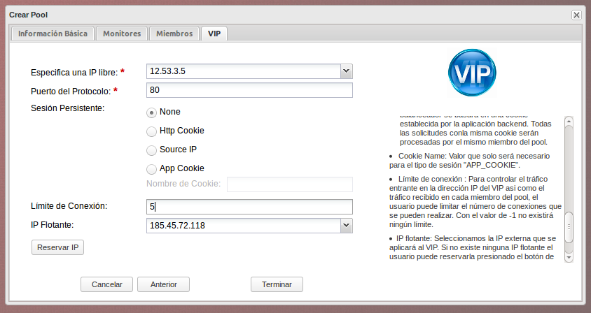

## Balanceador de carga

El balanceador de carga proporciona un servicio para dividir de manera equitativa, a través de un algoritmo, el tráfico recibido en servidores virtuales que atienden una aplicación. En este ejemplo vamos a partir de una infraestructura de dos servidores web y vamos a crear un balanceador de carga que nos posibilite repartir las peticiones entre los dos servidores.

### Configuración del balanceador de carga

Para acceder a la configuración del balanceador de carga escogemos la opción **Load Balancer**. Lo primero que tenemos que hacer es la creación de un **Pool**. Un pool es un conjunto de miembros, tales como servidores web donde se recibe y procesa el tráfico. La información que tenemo que configurar es la siguiente:

#### Información básica:

* Nombre: Elegimos un nombre que nos ayude a referenciar el balanceador.
* Subred: Del combo desplegable el usuario deberá seleccionar una subred en la que estarán todos los miembros del pool, es decir que la dirección fija de cada miembro pertenecerá a esta subred.
* Protocolo: Seleccionamos el protocolo que soportará este pool. Los protocolos actualmente soportados son TCP, HTTP y HTTPS.
* Método de balanceo: Este es el algorítmo usado para distribuir la carga (peticiones o conexiones) entre los distintos miembros del pool.
	* Round Robin : Con este algoritmo se reparten las peticiones equitativamente entre cada miembro sin tener en cuenta el estado ni carga de los servidores.
	* Least Connections : Con este algoritmo se reparten las peticiones a los miembros con menos conexiones activas.
* Descripción : Aquí el usuario puede introducir una breve explicación del funcionamiento del pool.

#### Monitores

Un **monitor** determina si un miembro del pool puede procesar una petición o no.
Para que un miembro este activo, cada uno de los monitores del pool deberá declararlo como activo.

Podemos tener varios monitores disponibles y entre ellos escoger los que queremos tener habilitados.

Al crear un monitor hay que indicar la siguiente información:

* Tipo: En este combo se muestra los distintos tipos de monitores soportados.
	* PING: Realiza un ping a los miembros haciendo uso de ICMP.
	* TCP: Realiza conexiones a los miembros utilizando TCP.
	* HTTP: Envía una petición HTTP a cada miembro.
	* HTTPS: Envía una petición segura HTTP a cada miembro.
* Retardo: Segundos de diferencia entre el envío de pruebas a los miembros.
* Tiempo de espera: El número máximo de segundos que un monitor esperará para que se establezca la conexión antes de que aborte la conexión. Este valor debe ser menor que el retardo.
* Intentos máximos: Con este valor se especifica el número de conexiones fallidas que se pueden producir antes de cambiar el estado de un miembro a INACTIVE.

#### Miembros

Un **miembro** representa el servicio que se ejecuta en el servidor, son responsables de atender las solicitudes recibidas a través de IP virtual del VIP.

Podemos tener varios miembros disponibles y entre ellos escoger los mimebros habilitados.

Al crear un nuevo miembro hay que indicar la siguiente información:

* Dirección IP: En este campo se mostrará una lista con los servidores y sus IP pertenecientes al tenant. El usuario deberá especificar el nombre del servidor que quiere añadir al balanceador.
* Peso: En este campo se determinará la carga de peticiones y conexiones a gestionar por este miembro.
* Puerto del protocolo: En este campo el usuario deberá especificar el puerto en el que el miembro escuchará las peticiones y conexiones.

#### VIP

El VIP especifica la dirección IP virtual y puerto de un balanceador el el cual se recibirá todo el tráfico de los clientes. Hay que indicar una IP fija al balanceador y una IP flotante para que sea accesible desde el exterior.

Para configurar la IP virtual tenemos que indicar la siguiente información:

* Especifica un IP libre: En este combo se muestra una lista de las IP libres pertenecientes a la subred del balanceador. El usuario deberá seleccionar una, está será la IP privada del VIP.
* Puerto del protocolo: El usuario deberá especificar el puerto en el que se escuchará el tráfico de los clientes.
* Sesión persistente: Con este parámetro especificaremos que queremos aplicar una sesión para las peticiones es decir que los miembros pertenecientes a la misma sesión sean procesados por el mismo miembro. Los tipos de sesiones actualmente soportados son:

	* HTTP COOKIE: En este caso el balanceador creará una cookie en la primera petición del cliente, de tal manera que las siguientes peticiones que contengas la misma cookie serán manejados por el mismo miembro del pool.
	* Source IP: Todas las conexiones con la misma IP de origen serán manejadas por el mismo miembro del pool.
	* APP COOKIE: El balanceador dependerá de una cookie establecida por la aplicación back-end. Todas las peticiones con la misma cookie serán procesadas por el mismo miembro del pool.
	* Nombre de Cookie: Nombre de Cookie que solo será necesario para el tipo de sesión "APP_COOKIE".

* Límite de conexión: Para controlar el tráfico entrante en la dirección IP del VIP asi como el tráfico recibido en cada miembro del pool, el usuario puede limitar el número de conexiones que se pueden realizar. Con el valor de -1 no existirá ningún límite.
* IP Flotante: En este combo se muestran las IP públicas actualmente reservadas. Con este valor se le puede asignar al VIP una IP pública para que tenga acceso desde el exterior.